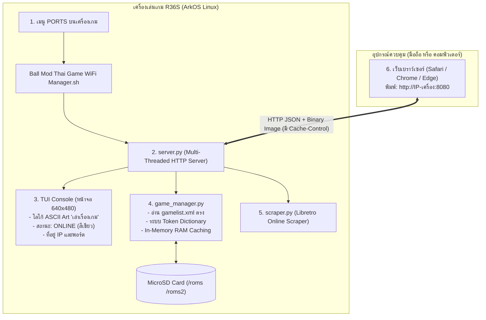

# 🎮 ArcOS Wi-Fi Manager (On-Device Edition)

> **จัดทำโดย:** [เพจเล่าเรื่องเกม](https://facebook.com) ร่วมกับ **AntiGravity**  
> **เป้าหมาย:** ระบบจัดการเกมและปกผ่าน Wi-Fi ความเร็วสูงสุด ทำงานบนเครื่องเล่น **R36S / ArkOS** โดยตรง จัดการผ่านมือถือหรือคอมพิวเตอร์ได้ทันทีโดยไม่ต้องติดตั้งโปรแกรมบนคอม

---

## 📌 สารบัญ (Table of Contents)
1. [ภาพรวมและความเร็วที่เหนือกว่า](#-ภาพรวมและความเร็วที่เหนือกว่า)
2. [สถาปัตยกรรมระบบ (System Architecture)](#-สถาปัตยกรรมระบบ-system-architecture)
3. [หน้าจอ Terminal (TUI) บนเครื่อง R36S](#-หน้าจอ-terminal-tui-บนเครื่อง-r36s-640x480)
4. [ฟังก์ชันการทำงานหลัก](#-ฟังก์ชันการทำงานหลัก-features)
5. [โครงสร้างไฟล์ของโปรเจกต์](#-โครงสร้างไฟล์ของโปรเจกต์)
6. [วิธีติดตั้งลงในเครื่อง R36S](#-วิธีติดตั้งลงในเครื่อง-r36s)
7. [ขั้นตอนการเปิดใช้งาน](#-ขั้นตอนการเปิดใช้งาน)
8. [คู่มือ API Endpoints (Data Dictionary & Token System)](#-คู่มือ-api-endpoints)
9. [การแก้ไขปัญหาเบื้องต้น (Troubleshooting)](#-การแก้ไขปัญหาเบื้องต้น-troubleshooting)

---

## ⚡ ภาพรวมและความเร็วที่เหนือกว่า

เดิมที การจัดการไฟล์บน ArkOS มักต้องใช้โปรแกรมบน Windows เชื่อมต่อผ่าน SSH / SFTP ซึ่งทำให้เกิดปัญหาคอขวด (Bottleneck) รุนแรง เนื่องจากชิป Wi-Fi USB Dongle บนเครื่อง R36S มีกำลังประมวลผลจำกัด การส่งข้อมูลภาพและคำสั่งผ่านช่องทางเข้ารหัส SSH ทำให้การดึงรายชื่อและรูปปกช้าและค้างบ่อยครั้ง

**ระบบ On-Device Edition แก้ปัญหานี้อย่างไร?**
- **รันบนตัวเครื่องเกม R36S โดยตรง:** รันผ่านสคริปต์ `.sh` ในหมวด **Ports** บนเครื่องเกม
- **อ่าน Flash Memory ตรง (Local Storage I/O):** ดึงข้อมูล `gamelist.xml` และรูปภาพจาก MicroSD Card ภายในเครื่องได้ทันทีในเวลาไม่ถึง 1 มิลลิวินาที
- **Token Dictionary System:** แปลงชื่อไฟล์ยาวและพาธที่ซับซ้อนให้กลายเป็นรหัสโทเคนสั้น (เช่น `t_gba_1`) ทำให้ข้อมูลเบา ปลอดภัย และไม่ติดปัญหาอักขระพิเศษ
- **Server-Side RAM Caching:** ประมวลผลข้อมูลครั้งแรกแล้วเก็บลงหน่วยความจำ RAM ครั้งต่อไปดึงค่าได้ทันที
- **Browser Caching (ETag / Cache-Control):** รูปปกจะถูกแคชลงในเบราว์เซอร์ของมือถือ/คอมพิวเตอร์ทันที เปิดซ้ำไม่ต้องส่งข้อมูลผ่าน Wi-Fi ซ้ำ
- **Zero-Dependency Python 3:** ทำงานด้วย Standard Library ของ Python 100% ไม่ต้องติดตั้งไลบรารีเสริม (`pip`) ใดๆ บนเครื่อง R36S

---

## 🏗️ สถาปัตยกรรมระบบ (System Architecture)



---

## 📟 หน้าจอ Terminal (TUI) บนเครื่อง R36S (640x480)

เมื่อเปิดโปรแกรมจากหมวด Ports หน้าจอ R36S จะแสดงผลแบบ ANSI Color Framebuffer Console โดยไม่เกิดปัญหาฟอนต์ภาษาไทยเพี้ยน ด้วยการออกแบบ **ASCII Art Logo** โดยเฉพาะ:

```text
====================================================================
          * * *   P A G E :  L A O   R E U A N G   G A M E   * * *  
====================================================================
        |           .---.                                
       ---          | * |                                
  .---. .-----. .---. '--. .--' .-----. .----. .---. .-----. .-----.
  |   | |  _  | |   |   / /     |  _  | | .  | |   | |  _  | | | | |
  |   | | | | | |   |  / /_     | | | | | |  | |   | | | | | | | | |
  |   | | |_| | |   | |  _ \    | |_| | | |  | |   | | |_| | | |_| |
  |   | |  _  | |   | | | | |   |  _  | | '-'| |   | |  _  | |  _  |
  '---' '-' '-' '---' '-' '-'   '-' '-' '--.-' '---' '-' '-' '-' '-'
                                           '-'                      
                [ L A O   R E U A N G   G A M E ]                   
--------------------------------------------------------------------
 Status:  [ ONLINE ]              Resolution: 640x480 (R36S / ArkOS)
 Address: http://192.168.1.188:8080
--------------------------------------------------------------------
 Instructions:
  1. Open a browser and enter the IP address shown above.
  2. Once connected, manage your games from the web page.
  3. To stop, close this terminal; the browser link will end too.
====================================================================
 Web Server is running on R36S. Press [Ctrl+C] or [B] button to exit
```

---

## ✨ ฟังก์ชันการทำงานหลัก (Features)

1. **แสดงสถานะพื้นที่เมมโมรี่การ์ด Real-time**
   - แสดงขนาดพื้นที่ทั้งหมด, พื้นที่ที่ใช้ไปแล้ว, พื้นที่ว่างคงเหลือ (GB) และคิดเป็นเปอร์เซ็นต์
   - ตรวจจับไดเรกทอรีทั้งแบบการ์ดใบเดียว (`/roms`) และระบบ 2 การ์ด (`/roms2`) อัตโนมัติ

2. **ระบบจัดการรูปปกเกม (Box Art Manager)**
   - 🌐 **ค้นหาปกออนไลน์อัตโนมัติ (Libretro Scraper):** ค้นหารูปปกความละเอียดสูงจากฐานข้อมูลทางการของ Libretro กดคลิกเดียว รูปจะถูกโหลดลง SD Card และผูกกับ `gamelist.xml` ทันที
   - 📤 **อัปโหลดรูปปกจากมือถือ/คอม:** เลือกรูปภาพ (.png, .jpg, .webp) จากเครื่องของคุณเพื่อตั้งเป็นปกได้ทันที

3. **แก้ไขชื่อเกมภาษาไทยและอังกฤษ (Game Renaming)**
   - แก้ไขชื่อเกมที่แสดงผลบนหน้าจอ ArkOS ได้ทันที โดยระบบจะเข้าไปปรับปรุงแท็ก `<name>` ใน `gamelist.xml` ให้อัตโนมัติ

4. **สำรองและดาวน์โหลดไฟล์เซฟ (Save Backup)**
   - ระบบตรวจจับไฟล์เซฟ (.srm, .sav, .state) ของแต่ละเกมอัตโนมัติ
   - มีปุ่มดาวน์โหลดไฟล์เซฟกลับมาเก็บไว้ในมือถือหรือคอมพิวเตอร์ ป้องกันเซฟหาย

5. **ลงเกมใหม่ (ROM Upload)**
   - เลือกระบบเครื่องเล่น หรือให้ระบบตรวจจับนามสกุลไฟล์อัตโนมัติ (.gba, .sfc, .nes, .chd, .iso, .zip ฯลฯ)
   - อัปโหลดไฟล์ตรงเข้าสู่ไดเรกทอรีเกม พร้อมอัปเดตรายชื่อใน `gamelist.xml` ทันที

6. **ลบเกมที่ไม่ต้องการ (Safe Deletion)**
   - ลบทั้งตัวไฟล์ ROM, รูปภาพปกในโฟลเดอร์ `images/` และลบรายการออกจาก `gamelist.xml` ครบวงจร

---

## 📁 โครงสร้างไฟล์ของโปรเจกต์

```
ArkOS-WiFi-Manager/
│
├── 📄 Ball Mod Thai Game WiFi Manager.sh   # สคริปต์เรียกโปรแกรมในเมนู Ports (Unix LF)
├── 📦 RetroGame-SDCard-Manager-WiFi-v1.1-Free.zip # ไฟล์ Zip พร้อมแตกไฟล์ลงเมมโมรี่การ์ด
├── 📄 INSTALL_GUIDE.md                # คู่มือภาษาไทยฉบับย่อ
├── 📄 README.md                       # เอกสารฉบับสมบูรณ์ (ไฟล์นี้)
│
└── 📁 arkos_wifi_manager/             # โฟลเดอร์โปรแกรมหลัก (วางไว้คู่กับสคริปต์ .sh)
      ├── server.py                    # Multi-threaded Web Server (Zero dependencies)
      ├── game_manager.py              # ตัวจัดการ ROM, gamelist.xml, Token & RAM Cache
      ├── tui.py                       # โมดูลแสดงผล Terminal ASCII Art 640x480
      ├── scraper.py                   # ตัวค้นหาปก Libretro (ใช้ urllib มาตรฐาน)
      ├── config.json                  # ตั้งค่าพอร์ต (8080) และ PIN
      └── 📁 web/
            └── index.html             # Responsive Web UI รองรับทั้ง มือถือ และ คอมพิวเตอร์
```

---

## 💾 วิธีติดตั้งลงในเครื่อง R36S

### วิธีที่ 1: ถอดเมมโมรี่การ์ดมาเสียบกับคอมพิวเตอร์ (แนะนำ)
1. ปิดเครื่อง R36S และถอดการ์ด MicroSD ที่เก็บเกมออกมาเสียบเข้ากับคอมพิวเตอร์
2. เปิดไดรฟ์ **`EASYROMS`** (หรือไดรฟ์เก็บเกมที่มีโฟลเดอร์ gba, psx, sfc)
3. เข้าไปที่โฟลเดอร์ **`ports`** (พาธจะเป็น `EASYROMS\ports\`)
4. คัดลอกสิ่งต่อไปนี้ไปวางในโฟลเดอร์ `ports`:
   - ไฟล์ **`Ball Mod Thai Game WiFi Manager.sh`**
   - โฟลเดอร์ **`arkos_wifi_manager`**
5. นำการ์ด MicroSD กลับไปเสียบที่เครื่อง R36S แล้วเปิดเครื่อง

### วิธีที่ 2: ถ่ายโอนไฟล์ผ่าน Wi-Fi / SSH
หากต่อ Wi-Fi อยู่แล้ว สามารถส่งไฟล์ผ่านโปรแกรม WinSCP หรือ FileZilla:
- Host: `IP ของ R36S` | User: `ark` | Password: `ark` | Port: `22`
- ปลายทาง: `/roms/ports/` (หรือ `/roms2/ports/`)
- เปิด Terminal แล้วรันคำสั่งกำหนดสิทธิ์:
  ```bash
  chmod +x "/roms/ports/Ball Mod Thai Game WiFi Manager.sh"
  ```

---

## 🎮 ขั้นตอนการเปิดใช้งาน

1. บนหน้าจอหลักของ R36S เลื่อนไปที่หมวด **PORTS**
2. เลือกเมนู **ArkOS WiFi Manager** แล้วกดปุ่ม **[A]**
3. หน้าจอเครื่องจะเข้าสู่หน้า Terminal สีสันสวยงาม พร้อมแสดงที่อยู่ IP เช่น:
   ```
   Status:  [ ONLINE ]
   Address: http://192.168.1.188:8080
   ```
4. หยิบโทรศัพท์มือถือ หรือคอมพิวเตอร์ที่ต่อ Wi-Fi วงเดียวกัน เปิดเบราว์เซอร์แล้วพิมพ์ URL ที่ปรากฏ
5. จัดการเกมได้ทันที
6. **เมื่อใช้งานเสร็จ:** กดปุ่ม **[B]** หรือกดปิดหน้า Terminal บน R36S ตัวเครื่องจะกลับสู่หน้าจอเกมตามปกติ

---

## 📡 คู่มือ API Endpoints

ระบบทำงานผ่าน RESTful JSON API โดยใช้สถาปัตยกรรม Token Dictionary:

| Method | Endpoint | รายละเอียด | พารามิเตอร์ / Body |
|---|---|---|---|
| `GET` | `/` | ส่งหน้าเว็บแอปพลิเคชัน Single Page App | - |
| `GET` | `/api/status` | ตรวจสอบสถานะการเชื่อมต่อ และพื้นที่ความจุเมมโมรี่ | - |
| `GET` | `/api/systems` | รายชื่อระบบเกมทั้งหมดที่มีในเครื่องพร้อมไอคอน | - |
| `GET` | `/api/games` | รายชื่อเกมในหมวดที่เลือก (ส่งคืนเป็น JSON แคช) | `system=gba`, `refresh=true` |
| `GET` | `/api/image` | ดึงรูปปกเกม (รองรับ Browser Cache 7 วัน) | `token=t_gba_1` |
| `POST` | `/api/rename` | เปลี่ยนชื่อเกมใน `gamelist.xml` ผ่าน Token | `{"token": "t_gba_1", "new_name": "ชื่อใหม่"}` |
| `POST` | `/api/upload_cover` | อัปโหลดรูปปกใหม่ | `multipart/form-data (token, file)` |
| `POST` | `/api/search_covers`| ค้นหาปกเกมออนไลน์จาก Libretro | `{"query": "Pokemon", "system": "gba"}` |
| `POST` | `/api/apply_cover` | ดาวน์โหลดรูปปกออนไลน์ลงเครื่องเกมโดยตรง | `{"token": "t_gba_1", "image_url": "https://..."}` |
| `POST` | `/api/upload_rom` | ลงไฟล์เกมใหม่เข้าเครื่องเล่น | `multipart/form-data (system, file, display_name)` |
| `GET` | `/api/download_rom`| ดาวน์โหลดไฟล์ ROM กลับมาที่คอม/มือถือ | `token=t_gba_1` |
| `GET` | `/api/download_save`| ดาวน์โหลดไฟล์เซฟ (.srm / .sav) | `token=t_gba_1` |
| `POST` | `/api/delete` | ลบเกม, รูปปก และข้อมูลใน XML | `{"token": "t_gba_1"}` |

---

## 🔧 การแก้ไขปัญหาเบื้องต้น (Troubleshooting)

> [!TIP]
> **เครื่อง R36S แสดง IP เป็น 127.0.0.1 หรือไม่ขึ้น IP**  
> ตรวจสอบให้แน่ใจว่าได้เสียบ USB Wi-Fi Dongle เข้ากับช่อง OTG ของเครื่อง R36S และต่อ Wi-Fi ในเมนู `Options > Wi-Fi` เรียบร้อยแล้ว

> [!NOTE]
> **ไม่พบเมนู Ball Mod Thai Game WiFi Manager ในหมวด PORTS**  
> ตรวจสอบว่าไฟล์ `Ball Mod Thai Game WiFi Manager.sh` อยู่ในโฟลเดอร์ `ports/` จริงหรือไม่ และชื่อไฟล์ลงท้ายด้วย `.sh`

> [!IMPORTANT]
> **เปลี่ยนชื่อเกมหรือเปลี่ยนปกแล้ว แต่ในเครื่อง R36S ยังไม่เปลี่ยน**  
> หลังจากจัดการเสร็จและกดปิดหน้า Terminal บน R36S ระบบ EmulationStation จะทำการโหลดค่าใหม่ให้อัตโนมัติ หรือสามารถเข้าเมนู `Main Menu > UI Settings > Fast Gamelist Reload` ได้เช่นกัน

---

*พัฒนาและเผยแพร่โดย **เพจเล่าเรื่องเกม** เพื่อสังคมคนรักเกมเรโทร*
